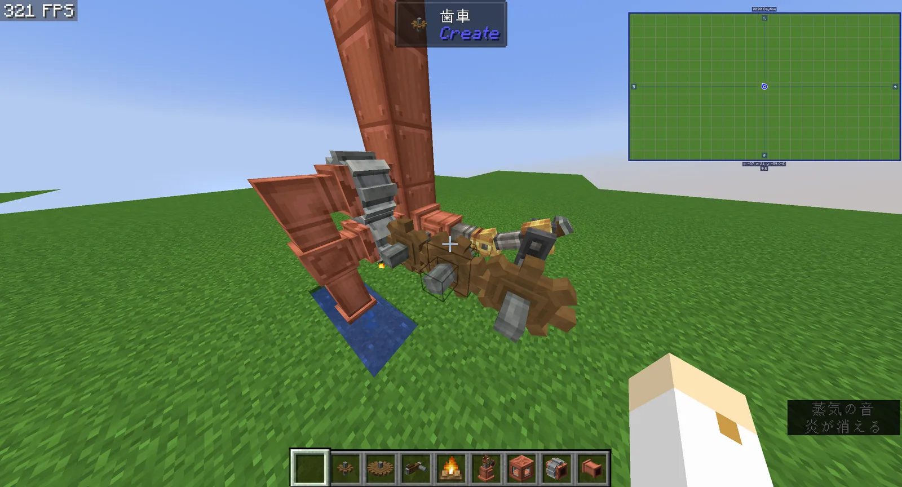

## 【焚き火駆動型「SE01_CampFire」】

### 許容応力：2048su

### パラメータ

- ボイラー状態：レベル最小
- 容量：1
- 熱量：1
- 水量：1

### 必要素材

| 必要素材 | 個数 | 備考 |
|---|---|---|
| 焚き火 | 1 | 魂の焚き火でも可 |
| 蒸気エンジン | 1 |  |
| 液体タンク | 4 |  |
| 液体パイプ | 3 |  |
| 水源（水バケツ） | 2 | 1x3の無限水源用 / 無限水源ならどこでも可 |
| メカニカルポンプ | 2 | 2つないと、水が十分に供給されない |
| シャフト | 1 | 蒸気エンジンに取り付ける |
| 歯車（小） | 3 |  |

### 概要

出力こそ低いが、序盤から作れる上に燃料を必要としない、非常に実用的な蒸気機関である。さらに小型であるため、小規模実験プラント用や農作業用など、幅広く用いることができる。ハンドクランクは応力不足でスタートできないため、水車や風車で動かす必要がある。
